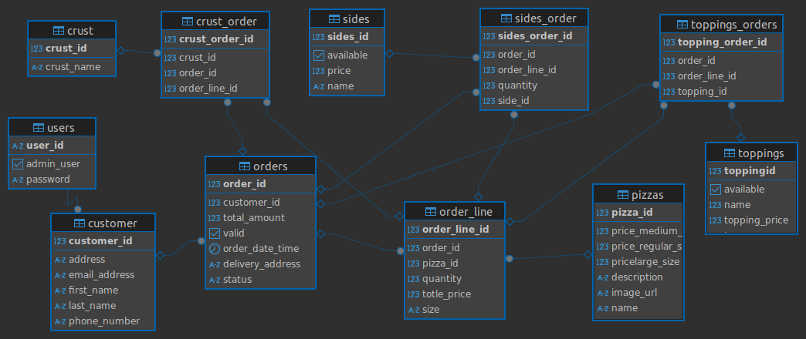

# 🍕 Pizza Palace - Full Stack Pizza Ordering Service

**Pizza Palace** is a full-stack proof-of-concept (PoC) application that allows customers to order pizzas online with full customization. It includes real-time inventory checks, a dynamic menu, and an admin panel to manage stock and products.


**Branching**
- main branch has mybatis implementation
- jpa branch has jpa implementation


**Schema diagram**



## 🧩 Project Structure

- **Frontend**: ReactJS + typescript
- **Backend**: Spring Boot (Java)
- **Database**: PostgreSQL

---

## 📦 Features

### PHASE 1 - Core Functionality

- ✅ View menu without login
- ✅ Select pizzas (veg/non-veg) with size and crust
- ✅ Customize with extra toppings and sides
- ✅ See real-time price summary
- ✅ Place and confirm order (no payment)
- ✅ Modify or cancel orders within 15 minutes
- ✅ Inventory validation before order placement

### PHASE 2 - Business Validations

- 🚫 Veg pizza can't have non-veg toppings
- 🚫 Non-veg pizza can't have paneer topping
- ✅ Only one crust per pizza
- ✅ Only one non-veg topping allowed per non-veg pizza
- 🎁 Large pizza includes 2 free toppings

### PHASE 3 - User Authentication & Admin Panel

- 🧑‍💼 Register/Login system for customers
- 🛠️ Admin panel for:
  - Managing inventory
  - Adding/updating pizza items, toppings, sides, and pricing

---

## 📑 Menu (Sample Data)

### 🍕 Pizzas

| Type           | Name                   | Regular | Medium | Large |
|----------------|------------------------|---------|--------|--------|
| Vegetarian     | Deluxe Veggie          | ₹150    | ₹200   | ₹325   |
|                | Cheese and Corn        | ₹175    | ₹375   | ₹475   |
|                | Paneer Tikka           | ₹160    | ₹290   | ₹340   |
| Non-Vegetarian | Non-Veg Supreme        | ₹190    | ₹325   | ₹425   |
|                | Chicken Tikka          | ₹210    | ₹370   | ₹500   |
|                | Pepper BBQ Chicken     | ₹220    | ₹380   | ₹525   |

### 🧀 Crusts

- New Hand-Tossed  
- Wheat Thin-Crust  
- Cheese Burst  
- Fresh Pan Pizza  

### 🌿 Extra Toppings

#### Veg Toppings

- Black Olive: ₹20  
- Capsicum: ₹25  
- Paneer: ₹35  
- Mushroom: ₹30  
- Fresh Tomato: ₹10  

#### Non-Veg Toppings

- Chicken Tikka: ₹35  
- BBQ Chicken: ₹45  
- Grilled Chicken: ₹40  

#### Extra Cheese: ₹35

### 🥤 Sides

- Cold Drink: ₹55  
- Mousse Cake: ₹90  

---

## ⚙️ Installation & Setup

### Backend (Spring Boot)

1. Clone the repository
2. Navigate to the `backend/` directory
3. Configure PostgreSQL in `application.properties`:
   ```properties
   spring.datasource.url=jdbc:postgresql://localhost:5432/pizzapalace
   spring.datasource.username=postgres
   spring.datasource.password=your_password
## Run:


 
./mvnw spring-boot:run
Frontend (ReactJS)
Navigate to the frontend/ directory

Install dependencies:
npm install
Start the development server:


 
npm start
🧪 Testing
✅ Unit tests included for:

Business rules
Inventory checks
Order validation logic
Run tests with:
bash
 
./mvnw test
🛡️ Design Principles
🔁 Easy to extend for new pizzas, rules, sides

🔍 Central validation services for business logic

🧩 Modular React components for UI customization

📦 Future Enhancements
✅ Payment integration


📱 Responsive mobile layout

📄 License
MIT License

Let me know if you want the folder structure or API documentation added too.
